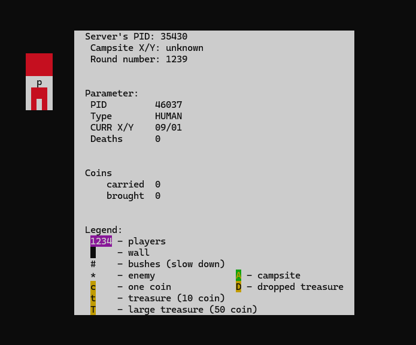

# Client Application for Simple Board Game

This is a **client application** for a simple, multi-process board game written in C for Linux
systems. The application connects to a server using shared memory and thread synchronization mechanisms to allow interactive multiplayer gameplay. It supports up to four independent player processes running concurrently.

>  **Important:** This client requires a **running server instance** to function properly.  
>  You can find the server application here: [Server Repository](https://github.com/KamilCiepluch/Server)

---

## Game Overview

Each player (1–4) joins a shared maze and competes to collect and deposit treasure:

- **Collect coins:** `c`, `t`, `T`
- **Avoid danger:** wild beasts `*` and collisions with other players
- **Deposit loot:** at the campsite `A` to add to your permanent **budget**
- **Drop site:** if you die or collide, coins drop at the site (`D`) and you respawn


---

## Player Types

- **HUMAN:** Uses keyboard arrow keys (w s a d) for movement
- **CPU (Bot):** Moves autonomously based on the map shared by the server

---

## Build & Run

### 1. Clone the Repository

```bash
git clone https://github.com/your-client-repo-link
cd your-client-repo
```

### 2. Configure with CMake
```bash
cmake CMakeLists.txt
```
### 3. Build the Project
```bash
make
```
### 4. Run the Client
Make sure the server is already running before starting the client.
```bash
./client
```

